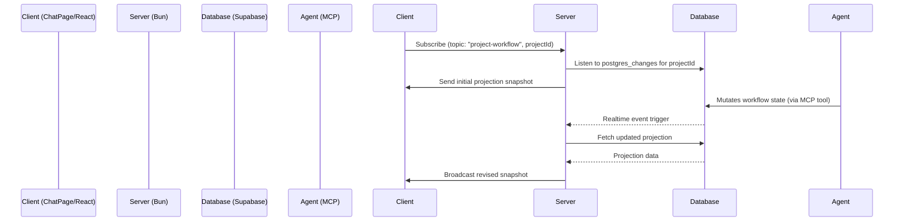

# Design: Real-time Workflow Engine Synchronization

## Context
Kanna uses a Bun-based server backend to coordinate agent runs and host the WebSocket server. The client UI connects via a WebSocket to send commands and receive real-time snapshots. Workflows are executed by an agent, which calls Kanna's MCP tools, writing events, runs, and artifacts to Supabase.

To keep the UI in sync with backend progress, we need to bridge Supabase changes to the client.

## Architecture

### Backend: Supabase Realtime to WebSockets
1. **Database Listener**: We will add a subscription listener to the `SupabaseWorkflowRuntimeStore`. Using the Supabase JS client (`@supabase/supabase-js`), we can listen to `postgres_changes` on:
   - `workflow_runs` (filter: `project_id=eq.{projectId}`)
   - `workflow_nodes` (globally, or filtering by current run)
   - `workflow_events` (globally)
   - `artifacts` (filter: `project_id=eq.{projectId}`)
   - `artifact_versions` (globally)
2. **Dynamic Subscriptions**: In `ws-router.ts`, we will maintain a `syncProjectWorkflowSubscriptions` function that lists all project IDs requested by active WebSocket clients. It will subscribe to database changes only for these projects and unsubscribe when all clients disconnect or unsubscribe.
3. **Broadcasting**: When database changes are received, the server calls `scheduleProjectWorkflowBroadcast(projectId)` to fetch the projection and push it to all subscribed connections.

### Client: React State Sync
1. **Existing Subscription**: The client currently subscribes to `project-workflow` within `ChatPage/index.tsx`.
2. **WebSocket Snapshot Handling**: The client automatically dispatches `project-workflow` messages back to the React component's local state, which then passes the latest projection down to `WorkflowTrackerPanel` via props.
3. **UI Rendering**: The `WorkflowTrackerPanel` renders the node tree, latest artifacts, and impact estimates dynamically based on the prop updates.
